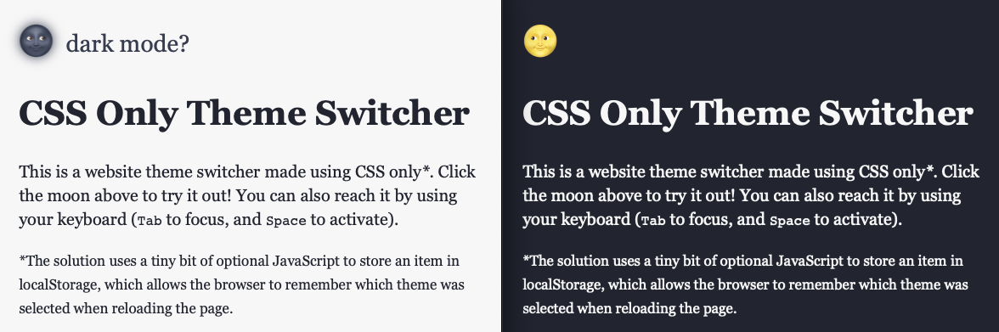

# CSS Only Theme Switcher

## About the project
This is a website theme switcher made with CSS only. There are two different versions of this:
1. Using a checkbox to switch between two themes
2. Using radio buttons for unlimited amount of themes

## Usage
[**Check it out live**](https://alexandersandberg.github.io/color-extractor/) *or* download the files and open `index.html` in your preferred browser.

## A project by Alexander Sandberg
Thanks for checking out my project! ❤️

If you want to get in touch, or check out my other work, you can find me online here:
* [Website](https://alexandersandberg.com) (alexandersandberg.com)
* [Twitter](https://twitter.com/alexandberg) (@alexandberg)
* [Medium](https://medium.com/@alexandersandberg) (@alexandersandberg)
* [Instagram](https://www.instagram.com/sandbergalexander/) (@sandbergalexander)
* [LinkedIn](https://www.linkedin.com/in/sandbergalex/) (@sandbergalexander)

## License
Distributed under the MIT License © [Alexander Sandberg](https://github.com/alexandersandberg)
